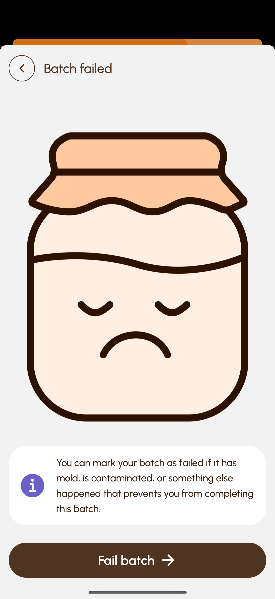

# Kombucha Keeper

Kombucha Keeper helps you keep track of your Kombucha batches and notifies you when it might be ready.

[![AppStore][appstore-image]][appstore-url] [![PlayStore][playstore-image]][playstore-url]

### Motivation
Kombucha is a healthy, fizzy drink that is easy to brew at home. Its taste can be greatly influenced during 
fermentation, which allows for a lot of experimentation. I needed a way to keep track of all my current and past 
batches in order to hone my brewing skills.

### Screenshots

|  |     |  |
|------------------------|--------------------------------|-----------------------------|
|   |  |  |

### Technical details
- **React Native + Expo Router + TypeScript** targeting iOS and Android
- Local notifications scheduled with **expo-notifications**
- Theming via **NativeWind** (Tailwind)
- Custom animated **number-wheel input** ([forked](https://github.com/wdudokvanheel/react-native-wheel-picker) and modified)
- All images are **SVGs** for maximum fidelity and infinite scalability

### Challenges
Implementing a bespoke user interface brought some challenges, as I did not want to compromise on the design. The most
notable challenge was the number input/wheel (see the “New Batch” screenshot). In the end I chose to fork an existing
input-wheel component and change its inner workings to match the design.

### Roadmap

- [ ] Add a panel to the batch detail view when it's complete
- [ ] Move delete to the batch action menu
- [ ] Optional 'Burp' alarm for F2 fermentation  
- [ ] Allow user to select exact notification time down to the minute

[appstore-image]: docs/appstore.png
[appstore-url]: https://apps.apple.com/us/app/kombucha-keeper/id6746731068?platform=iphone
[playstore-image]: docs/playstore.png
[playstore-url]: https://play.google.com/store/apps/details?id=com.bitechular.kombuchakeeper
